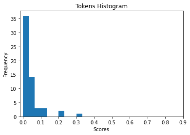
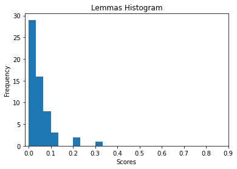

```python
## CSIS 44620 Web Mining and Applied Natural Language Processing
## homework for Module 7  Final Project for Bonus
## Presented by Ramon Torres
## DEC 7, 2022
## https://github.com/rtmtorresmorales/44620-Module-7-Final-Project
```


```python
# 1 Code to extract article, orginial article was discarded because text was not available.  
import requests
from bs4 import BeautifulSoup
import pickle
import requests
import matplotlib.pyplot as plt
import numpy as np
from matplotlib import colors
from matplotlib.ticker import PercentFormatter
import spacy
from spacytextblob.spacytextblob import SpacyTextBlob

from bs4 import BeautifulSoup
response = requests.get('https://web.archive.org/web/20210326110857/https://hackaday.com/2021/03/23/hey-google-is-my-heart-still-beating/')
print(response.status_code)
print(response.headers['content-type'])
parser = 'html.parser'
soup = BeautifulSoup(response.text, parser)
article_page = requests.get('https://web.archive.org/web/20210326110857/https://hackaday.com/2021/03/23/hey-google-is-my-heart-still-beating/')
article_html = article_page.text

with open('python-match.pkl', 'wb') as f:
    pickle.dump(article_page.text, f)

for header in soup.findAll('h1'):
    print('h1 header:', header)
    print('h1 text:', header.text)
```

    200
    text/html; charset=UTF-8
    h1 header: <h1 class="site-title">
    <a href="https://web.archive.org/web/20210326110857/https://hackaday.com/" rel="home">Hackaday</a>
    </h1>
    h1 text: 
    Hackaday
    
    h1 header: <h1 class="entry-title" itemprop="name">Hey Google, Is My Heart Still Beating?</h1>
    h1 text: Hey Google, Is My Heart Still Beating?
    h1 header: <h1 class="screen-reader-text">Post navigation</h1>
    h1 text: Post navigation
    h1 header: <h1 class="widget-title">Search</h1>
    h1 text: Search
    h1 header: <h1 class="widget-title">Never miss a hack</h1>
    h1 text: Never miss a hack
    h1 header: <h1 class="widget-title">Subscribe</h1>
    h1 text: Subscribe
    h1 header: <h1 class="widget-title">If you missed it</h1>
    h1 text: If you missed it
    h1 header: <h1 class="widget-title">Our Columns</h1>
    h1 text: Our Columns
    h1 header: <h1 class="widget-title">Search</h1>
    h1 text: Search
    h1 header: <h1 class="widget-title">Never miss a hack</h1>
    h1 text: Never miss a hack
    h1 header: <h1 class="widget-title">Subscribe</h1>
    h1 text: Subscribe
    h1 header: <h1 class="widget-title">If you missed it</h1>
    h1 text: If you missed it
    h1 header: <h1 class="widget-title">Categories</h1>
    h1 text: Categories
    h1 header: <h1 class="widget-title">Our Columns</h1>
    h1 text: Our Columns
    h1 header: <h1 class="widget-title">Recent comments</h1>
    h1 text: Recent comments
    h1 header: <h1 class="widget-title">Now on Hackaday.io</h1>
    h1 text: Now on Hackaday.io
    h1 header: <h1 class="footer-widget-title">Never miss a hack</h1>
    h1 text: Never miss a hack
    h1 header: <h1 class="footer-widget-title">Subscribe to Newsletter</h1>
    h1 text: Subscribe to Newsletter
    


```python
#2  Read and print article and polarity
with open('python-match.pkl', 'rb') as f:
    article_html = pickle.load(f)

parser = 'html.parser'
soup = BeautifulSoup(article_html, parser)
article_element = soup.find('article')
print(article_element.get_text())

nlp = spacy.load('en_core_web_sm')
nlp.add_pipe('spacytextblob')
doc = nlp(article_element.get_text())
#docx = nlp(poem)
print ('Polarity: ', doc._.polarity)
# For added bonus print subjectivity
print ('Subjectivity: ', doc._.subjectivity)

```

    
    
    Hey Google, Is My Heart Still Beating?
    
    
                    17 Comments            
    
    by:
    Tom Nardi
    
    
    
    March 23, 2021
    
    
    
    
    
    
    
    
    University of Washington researchers studying the potential medical use of smart speakers such as Amazon’s Echo and Google’s Nest have recently released a paper detailing their experiments with non-contact acoustic heartbeat detection. Thanks to their sensitive microphone arrays, normally used to help localize voice commands from the user, the team proposes these affordable and increasingly popular smart home gadgets could lead a double life as unobtrusive life sign monitors. The paper goes so far as to say that even with multiple people in the room, their technique can be used to monitor the heart and respiratory rate of a specific target individual.
    Those are some bold claims, but they aren’t without precedent. Previous studies performed at UW in 2019 demonstrated how smart speaker technology could be used to detect cardiac arrest and monitor infant breathing. This latest paper could be seen as the culmination of those earlier experiments: a single piece of software that could not just monitor the vitals of nearby patients, but actually detect a medical emergency. The lifesaving potential of such a program, especially for the very young and elderly, would be incredible.
    So when will you be able to install a heart monitor skill on the cheap Echo Dot you picked up on Prime Day? Well, as is often the case with this kind of research, putting the technique to work in the real-world isn’t nearly as easy as in the laboratory. While the concept is promising and is more than worthy of further research, it may be some time before our lowly smart speakers are capable of Star Trek style life-sign detection.
    
    Can You Hear Me Now?
    The researchers explain in the paper that their work is built on earlier experiments that used powerful ultrasound transducers to detect minute displacements of a patient’s chest, abdomen, and neck. Relatively large motions are the result of normal breathing action, while smaller sub-millimeter deflections correspond to the individual’s heartbeat. While this research showed it was possible to detect vital signs acoustically from a distance, the paper says the ultrasound transmissions used were of a frequency and intensity not achievable by the consumer smart speaker hardware they were investigating.
    In fact, the paper explains that standard smart speakers are not particularly well suited to ultrasonic transmission or reception in the first place, as they have naturally been designed to prioritize human speech and music. That said, the researchers reference the fact that Google’s Nest already uses ultrasonic range finding to adjust visual elements such as font size. Determining how far a viewer is standing from the screen is a far cry from picking up 0.5 mm vibrations in their carotid artery, but it’s a start.
    The team’s sonar implementation was designed around the inherent limitations of smart speaker hardware, and generates a 50 ms frequency modulated continuous wave (FMCW) chirp between 18 kHz and 22 kHz. This allows the software to not only calculate a very precise distance to a stationary target, but ignore any echos that are returned beyond a predefined range.
    Even still, the wavelength of sound at these frequencies is far larger than some of motions the software is looking for. With a bodily deflection of just 0.3 mm to 0.8 mm, individual heartbeats are particularly difficult to detect. Several layers of filters are applied to try and improve the signal-to-noise ratio, and adaptive beamforming allows the speakers to zero in on the target.
    The paper concludes while that the resulting pulse data is not as accurate as the traditional electrocardiogram (ECG) readings being used as a control, it was close enough to be a useful diagnostic tool for both healthy patients and those suffering from various cardiac abnormalities. Especially when taking into account the advantages offered by the non-contact approach, particularly for telemedicine applications.
    Ideal Conditions
    While the researchers were able to pull some impressive data with their test setup, it should be said that there are several caveats which (at least for now) would make it difficult to put this technique into practice. For one thing, the smart speaker needs to be aimed at the patient’s chest and placed at a distance of 40 cm to 60 cm (15 in to 23 in). Accuracy drops off with distance, and at least in this version of the software, any returns beyond one meter are considered background noise and are ignored entirely.
    Ideal placement for the smart speaker.
    This is obviously at odds with normal smart speaker placement. Even if the speaker was close enough to the patient, say on a table next to a bed or chair, it’s normally going to be pointed up towards the ceiling. While testing did show the software was able to function when the patient was off to the left or right side, the error rate increased considerably.
    To be useful, the device would likely need to be placed in a custom mount that would keep it in the ideal position while measurements were being taken. This isn’t a huge burden, and the cost would largely be negligible, but it does speak to the relative inflexibility of this approach.
    Interestingly, the tests showed that the clothing worn by the patient had only a slight impact on the acoustic readings. While tight fitting garments produced the best results, even loose blouses and hospital gowns didn’t prevent the system from collecting useful data. Thick fabrics or multiple layers of clothing did attenuate the signal however, which could potentially be a problem depending on climate.
    Similarly the paper found that the system couldn’t reliably extract a cardiac rhythm from extremely obese patients, as the excess tissue dampened the underlying bodily motion. Accordingly, patients with a body mass index (BMI) of 35 or higher were excluded from the primary test group. The software was separately evaluated with a group of five individuals who had a median BMI of 38.6, and of those, it was only able to detect the heart rate of one participant. The paper notes that this falls in line with the findings of previous experiments, and notes that obese patients simply aren’t good candidates for non-contact sensing technology at this time.
    Breaking into The Walled Garden
    Issues with speaker placement and the type of clothing the patient is wearing are, in the grand scheme of things, fairly minimal. Some refinement is obviously necessary, and clearly it won’t be as simple as just installing a piece of software on your Amazon Echo and getting the baby’s heart rate displayed on your phone without some special considerations being made, but all the pieces seem to be in place for somebody to run with the idea. Unfortunately, despite such promising research, bringing this capability to consumer smart speakers simply isn’t possible right now.
    While the paper makes extensive references to these commercial devices, and uses their hardware capabilities as a limiting factor in all of their experiments, the researchers admit the software they’ve developed can’t actually be used on any currently available product from the likes of Google or Amazon. The simple fact is that the APIs available to developers don’t provide the low-level hardware access required to implement their sonar technique. Giving third party applications direct control over the speaker and microphones would raise obvious security concerns, so this type of functionality would either need to be built into the system from the start by the manufacturer, or potentially be relegated to specifically provisioned units intended for healthcare providers.
    Taking The Long Way Around
    Even if bureaucratic concerns keep the team’s software off of commercially available smart speakers, the research they’ve conducted is still extremely valuable. The possibilities offered by an affordable, automated method of taking a patient’s vitals without physical contact are undeniably compelling, especially with the lingering threat of COVID-19. Technology that can help monitor and diagnose potentially contagious patients without risking exposure to the nurses and physicians attending to them is in high demand, and will continue to be of great interest even when this current crisis is behind us.
    miniDSP UMA-8-S
    If commercial smart speakers aren’t a viable platform for this software, what then? Well for one thing, you could simply build your own hardware. As outlined at the end of the paper, all of the experiments were performed with a UMA-8-S seven microphone array from miniDSP and a PUI Audio AS05308AS-R speaker connected to desktop computer. The UMA-8-S is something of a development kit itself, and includes onboard digital signal processor (DSP) with beamforming capability. Marketed towards both professional and DIY users, it looks to be a particularly interesting device in its own right.
    The team says the Python source code for their project is also available upon request, so long as you agree to a non-commercial license. Put simply, everything needed to recreate this project is readily available for anyone who wants it. Whether it becomes an area of exploration for biohackers or gets refined and marketed by a some tech entrepreneur, it seems inevitable that this technology will bubble its way to the surface in the coming years.
    
    
    
    
     
    
    
    
    
    
    
    
    
    
    
    
    
    
    
    
    
    
    
    
    Posted in Engineering, Featured, Interest, Medical Hacks, Original Art, SliderTagged active sonar, medical sensors, microphone array, smart speaker, ultrasonic, whitepaper 
    
    Polarity:  0.145060077285352
    Subjectivity:  0.5142893370365899
    


```python
# Polarity with .145 shows a timid positive sentiment, subjectivity with .514 is in the middle of author's opinion and a possible factual information.
```


```python
#3 Load the article text into a trained spaCy pipeline, and determine the 5 most frequent tokens
import spacy
from spacytextblob.spacytextblob import SpacyTextBlob
from collections import Counter

nlp = spacy.load('en_core_web_sm')
nlp.add_pipe('spacytextblob')
doc = nlp(article_element.get_text())

def we_care_about(token):
    return not (token.is_space or token.is_punct or token.is_stop)

interesting_tokens = [token for token in doc if we_care_about(token)]
word_freq = Counter(map(str,interesting_tokens))
print(word_freq.most_common(5))
```

    [('smart', 14), ('paper', 11), ('speaker', 11), ('software', 10), ('speakers', 7)]
    


```python
#4 Load the article text into a trained spaCy pipeline, and determine the 5 most frequent lemmas
interesting_lemmas = [token.lemma_ for token in doc if we_care_about(token)]
lemma_freq = Counter(interesting_lemmas)
print(lemma_freq.most_common(5))
```

    [('speaker', 18), ('smart', 14), ('patient', 13), ('paper', 11), ('software', 10)]
    


```python
#4 Make a list containing the scores (using tokens) of every sentence in the article, and plot a histogram
interesting_token = list()
for token, freq in word_freq.most_common(5):
    interesting_token.append(token)

interesting_lemma = set()
for lemma, freq in lemma_freq.most_common(5):
    interesting_lemma.add(lemma)

sentences = list(doc.sents)
stringlist = list()
nmwrds = list()
for sentence in sentences:
    scount = 0
    sent_str = str(sentence).replace('\n','').replace('  ',' ')
    stringlist.append(sent_str)
    for token in sentence:
        if not(token.is_space or token.is_punct):
            scount +=1
    nmwrds.append(scount)

def score_sentence_by_token(sentence, interesting_token):
    tcount = 0
    for token in sentences[sentence]:
        if token.text.lower() in interesting_token:
            tcount += 1
    if tcount == 0:
        print('No interesting tokens')
    tscore = tcount/nmwrds[sentence]
    print('sentence:',stringlist[sentence], 'tokens:',tcount,'words:',nmwrds[sentence],'score:',tscore)

def score_sentence_by_lemma(sentence, interesting_lemma):
    lcount = 0
    for token in sentences[1]:
        if token.lemma_.lower() in interesting_lemma:
            lcount += 1
    if lcount == 0:
        print('No interesting lemmas')
    lscore = lcount/nmwrds[sentence]
    print('sentence:',stringlist[sentence], 'lemmas:',lcount,'words:',nmwrds[sentence],'score:',lscore)
    
score_sentence_by_token(1, interesting_token)
score_sentence_by_lemma(1, interesting_lemma)
```

    sentence: Thanks to their sensitive microphone arrays, normally used to help localize voice commands from the user, the team proposes these affordable and increasingly popular smart home gadgets could lead a double life as unobtrusive life sign monitors. tokens: 1 words: 37 score: 0.02702702702702703
    sentence: Thanks to their sensitive microphone arrays, normally used to help localize voice commands from the user, the team proposes these affordable and increasingly popular smart home gadgets could lead a double life as unobtrusive life sign monitors. lemmas: 1 words: 37 score: 0.02702702702702703
    


```python
import matplotlib.pyplot as plt
import numpy as np
nmtkns = list()
tscores = list()
for sentence in sentences:
    tcount = 0
    for token in sentence:
        if token.text.lower() in interesting_token:
            tcount +=1
    nmtkns.append(tcount)
for i in nmwrds:
    tscores = [t/w for t,w in zip(nmtkns,nmwrds)]

t = np.array(tscores)  
plt.hist(t)
plt.xlabel('Scores')
plt.ylabel('Frequency')
plt.title('Tokens Histogram')
plt.xticks(np.arange(0, 1, 0.1))
plt.show()
```


    

    


# Most common range from 0.0 to 0.1


```python
# 6 Make a list containing the scores (using lemmas) of every sentence in the article, and plot a histogram with appropriate  titles and axis labels of the scores.


import matplotlib.pyplot as plt
import numpy as np

nmlmas = list()
lscores = list()
for sentence in sentences:
    lcount = 0
    for token in sentence:
        if token.lemma_.lower() in interesting_lemma:
            lcount +=1
    nmlmas.append(lcount)
for i in nmlmas:
    lscores = [t/w for t,w in zip(nmlmas,nmwrds)]

l = np.array(lscores)  
plt.hist(l)
plt.xlabel('Scores')
plt.ylabel('Frequency')
plt.title('Lemmas Histogram')
plt.xticks(np.arange(0, 1, 0.1))
plt.show()
```


    

    


# Most common range 0.0 to 0.1


```python
# 7 Using the histograms from questions 5 and 6, decide a "cutoff" score for tokens and lemmas such that fewer than half the sentences would have a score greater than the cutoff score. Record the scores in this Markdown cell
```


```python

top_idx_t = np.argsort(x)[-10:]
top_values_t = [t[i] for i in top_idx_t]
print(min(top_values_t))

top_idx_l = np.argsort(x)[-10:]
top_values_l = [l[i] for i in top_idx_l]
print(min(top_values_l))

```

    0.058823529411764705
    0.08571428571428572
    

# Cutoff Score (tokens): 0.058823529411764705
# Cutoff Score (lemmas): 0.08571428571428572


```python
#8 Create a summary of the article by going through every sentence in the article and adding it to an (initially) empty list if its score (

tsummary = list()
tsumscores = list()

for sentence in sentences:
    tcount = 0
    scount = 0
    for token in sentence:
        if not(token.is_space or token.is_punct):
            scount += 1
        if token.text.lower() in interesting_token:
            tcount += 1
    if tcount != 0:
        tscore = tcount/scount
        if tscore >= min(top_values_l):
            sent_str = str(sentence).replace('\n','').replace('  ',' ')
            tsummary.append(sent_str)
            tsumscores.append(tscore)

print(' '.join(tsummary))
```

    Previous studies performed at UW in 2019 demonstrated how smart speaker technology could be used to detect cardiac arrest and monitor infant breathing. In fact, the paper explains that standard smart speakers are not particularly well suited to ultrasonic transmission or reception in the first place, as they have naturally been designed to prioritize human speech and music. Ideal placement for the smart speaker. This is obviously at odds with normal smart speaker placement. Unfortunately, despite such promising research, bringing this capability to consumer smart speakers simply isn’t possible right now. Taking The Long Way AroundEven if bureaucratic concerns keep the team’s software off of commercially available smart speakers, the research they’ve conducted is still extremely valuable. If commercial smart speakers aren’t a viable platform for this software, what then? Posted in Engineering, Featured, Interest, Medical Hacks, Original Art, SliderTagged active sonar, medical sensors, microphone array, smart speaker, ultrasonic, whitepaper 
    


```python
# 9 Print the polarity score of your summary you generated with the token scores 
doc = nlp(' '.join(tsummary))

print("Token summary polarity: ", doc._.blob.polarity)
print(tsumscores)
print("Token summary sentence count: ", len(tsummary))
```

    Token summary polarity:  0.09747474747474748
    [0.08695652173913043, 0.08571428571428572, 0.3333333333333333, 0.2, 0.1111111111111111, 0.10344827586206896, 0.21428571428571427, 0.1]
    Token summary sentence count:  8
    


```python
# 10 Create a summary of the article by going through every sentence in the article 

lsummary = list()
lsumscores = list()

for sentence in sentences:
    lcount = 0
    scount = 0
    for token in sentence:
        if not(token.is_space or token.is_punct):
            scount += 1
        if token.lemma_.lower() in interesting_lemma:
            lcount += 1
    if lcount != 0:
        lscore = lcount/scount
        if lscore >= min(top_values_l):
            sent_str = str(sentence).replace('\n','').replace('  ',' ')
            lsummary.append(sent_str)
            lsumscores.append(lscore)

print(' '.join(lsummary))

```

    Previous studies performed at UW in 2019 demonstrated how smart speaker technology could be used to detect cardiac arrest and monitor infant breathing. This latest paper could be seen as the culmination of those earlier experiments: a single piece of software that could not just monitor the vitals of nearby patients, but actually detect a medical emergency. In fact, the paper explains that standard smart speakers are not particularly well suited to ultrasonic transmission or reception in the first place, as they have naturally been designed to prioritize human speech and music. For one thing, the smart speaker needs to be aimed at the patient’s chest and placed at a distance of 40 cm to 60 cm (15 in to 23 in). Ideal placement for the smart speaker. This is obviously at odds with normal smart speaker placement. Unfortunately, despite such promising research, bringing this capability to consumer smart speakers simply isn’t possible right now. Taking The Long Way AroundEven if bureaucratic concerns keep the team’s software off of commercially available smart speakers, the research they’ve conducted is still extremely valuable. If commercial smart speakers aren’t a viable platform for this software, what then? Posted in Engineering, Featured, Interest, Medical Hacks, Original Art, SliderTagged active sonar, medical sensors, microphone array, smart speaker, ultrasonic, whitepaper 
    


```python
#11 Print the polarity score of your summary you generated


doc = nlp(' '.join(lsummary))

print("Lemma summary polarity: ", doc._.blob.polarity)
print(lsumscores)
print("Lemma summary sentence count: ", len(lsummary))

```

    Lemma summary polarity:  0.09896214896214899
    [0.08695652173913043, 0.08823529411764706, 0.08571428571428572, 0.0967741935483871, 0.3333333333333333, 0.2, 0.1111111111111111, 0.10344827586206896, 0.21428571428571427, 0.1]
    Lemma summary sentence count:  10
    


```python
#12 Compare your polarity scores of your summaries to the polarity scores of the initial article. Is there a difference? Why do you think that may or may not be?. Answer in this Markdown cell.


```

# 12 Polarity of tokenes and lemma summaries are less than orginal article,  original articles reached .145 versus lemma and token are in the range of .098 and .097.  Values are so low that may not be significant, but as we reduced the number od sentences and tokenize polarity keep moving to the center values of the actual polarity range between -1 and =+1.


```python
#13 Based on your reading of the original article, which summary do you think is better (if there's a difference). Why do you think this might be?
```

#13 The summaries are pretty much the same, perhaps for reserach purposes a more detailed summary will be more beneficial to determine the applicability and usefulness of the article for a researcher.
